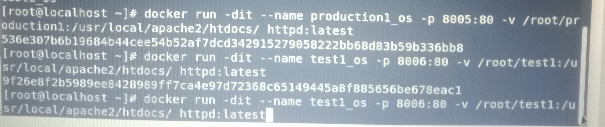

# jenkinsproject:

# 1: Launching 2 docker containers named production1_os and test1_os from the httpd image. 
   

# 2: Create a Jenkins job for Production with master branch  & give the repo link. 

In the Execute Shell Section, give the commands to copy the  code to the web volume folder that is linked to the Production Server container.

# 3: Create second Jenkins job for the Test Server for dev1 branch. 

In the execute shell section, given copy command to copy the code. 

# 4 : In Our third Jenkins task the succeeded   task will run that would automatically merge the two branches & deploy the tested code on the main Production Server. 

In the third task, along with the repo link, we need to provide the GitHub ctredentials so that it is authenticated to merge the two branches on GitHub.
 
Used the Merge Before Build option to merge the two branches together.

Using the Git Publisher option.
